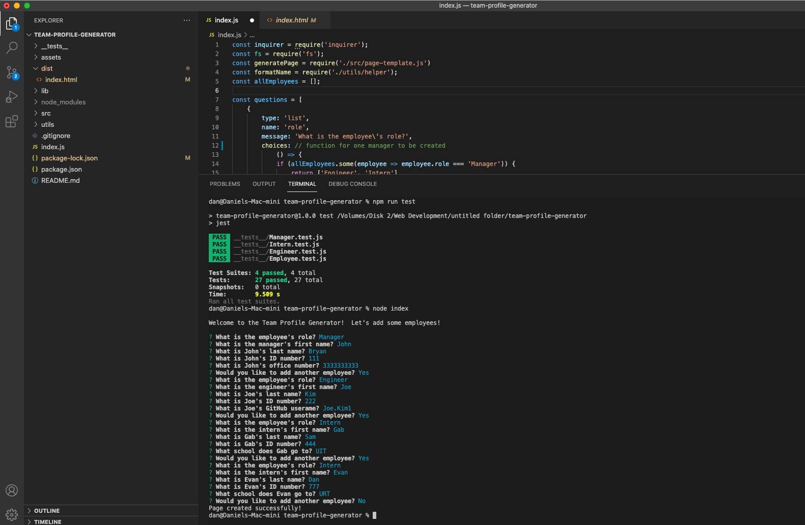
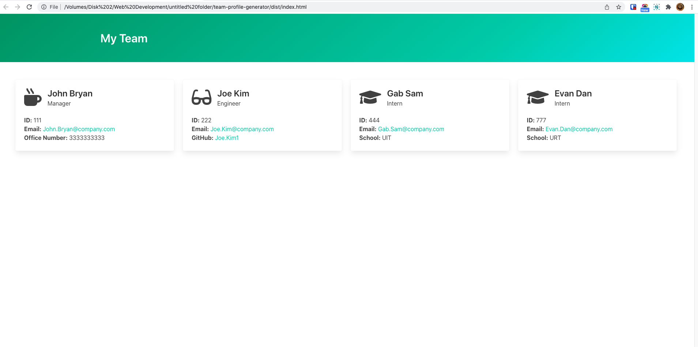

# Team Profile Generator

## Description
Building a Node.js command-line application that takes in information about employees on a software engineering team and generates an HTML webpage that displays summaries for each person.

## Contents
* [Installation](#Installation)
* [Usage](#Usage)
   * [Video Demo](#Video-Demo)
   * [Screenshots](#Screenshots)
* [Tests](#Tests)

## Installation
To use this application, please install: 
```
npm install inquirer
```
    
## Usage
After cloning the repo and installing the required npm packages, use the command line to navigate to the root of the application and run `node index`.  
Follow prompts to add team members to your Profile.  Your generated team profile page will be created in the `./dist` folder. 
    
### Video Demo
A video demonstration of the application [YouTube](https://youtu.be/mjaTXvkpAcU).

### Screenshots

The application runs from the command line as seen above.
<br/><br/>

Example of Team Profile generated.

## Tests
To tests the application, install
```
npm install jest
```
and run `npm run test` from the command line.
